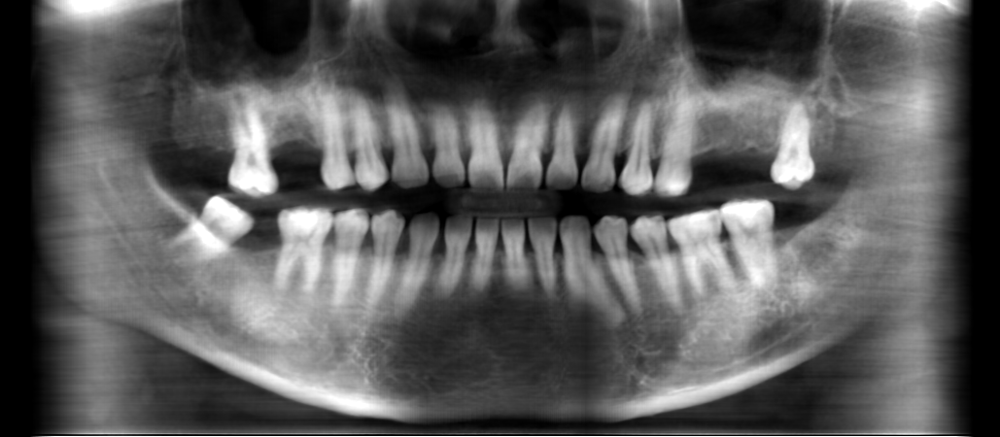
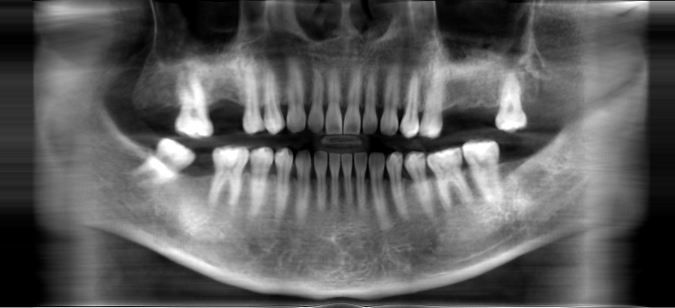

# ArchPresser

## General libraries

With simple ray-sum to developable natural cubic spline surface

## Ours

With thickness-aware ray-sum to non-developable bivariate B-spline surface

## Howto
First, compile the code.
```sh
$ ./bind.sh
```
Then, use the library like below. (e.g. test.py)
```python
from arch_presser import ArchPresser
...
ArchPresser().preprocess(
    dir_path,
    upper_start_points,
    upper_end_points ,
    lower_start_points,
    lower_end_points,
    pixel_size
).project(thickness).press(image_path, clamp)
...
```